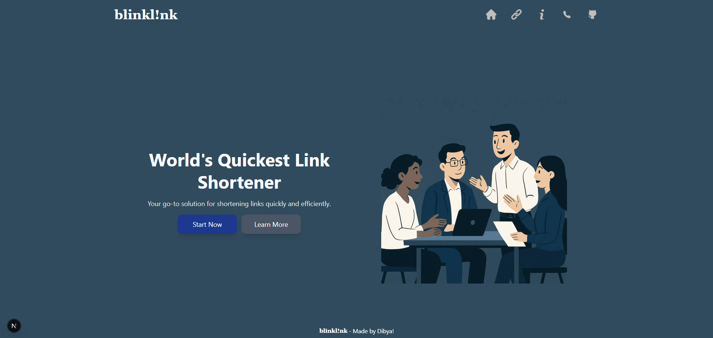
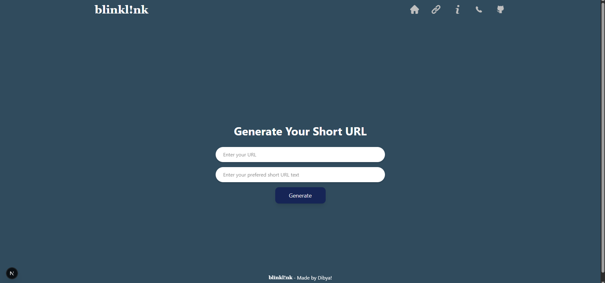

# blinkl!nk - Modern URL Shortener


A lightning-fast, modern URL shortener built with Next.js 13, featuring a sleek UI and powerful functionality.

## ✨ Features

- **Instant URL Shortening**: Create short, memorable links in seconds
- **Custom Short URLs**: Choose your preferred short URL text
- **Responsive Design**: Seamless experience across all devices
- **Modern UI/UX**: Clean interface with smooth animations
- **Privacy Focused**: No tracking, no data selling

## 🚀 Tech Stack

- **Frontend**: 
  - Next.js 13 (App Router)
  - React 18
  - TailwindCSS
- **State Management**:
  - React Hooks
- **Language**: 
  - TypeScript/JavaScript
- **Styling**: 
  - Tailwind CSS
  - Custom animations
  - Responsive design
- **Icons & Assets**: 
  - Custom-optimized SVG icons
  - Optimized images
- **Deployment**: 
  - Vercel (Edge Network)
- **Development Tools**:
  - ESLint
  - Prettier
  - Git

## 🛠️ Installation

1. Clone the repository:
```bash
git clone https://github.com/dibya-22/Blinklink.git
```

2. Install dependencies:
```bash
cd Blinklink
npm install
```

3. Create a `.env.local` file in the root directory:
```env
NEXT_PUBLIC_HOST=your-domain.com
```

4. Run the development server:
```bash
npm run dev
```

## 🔧 Usage

1. Visit the homepage
2. Enter your long URL
3. Choose a custom short URL (optional)
4. Click "Generate"
5. Copy and share your shortened link!

## 📱 Screenshots

<div align="center">
  
  <p><em>Homepage - Modern and intuitive interface</em></p>
  
  
  <p><em>URL Shortening Interface - Simple and effective</em></p>
</div>

## 🌟 Key Features Explained

### Instant URL Shortening
- Lightning-fast processing
- Custom short URL support
- Automatic URL validation

### Modern UI/UX
- Responsive design
- Smooth animations
- Intuitive interface
- Dark mode optimized

### Privacy & Security
- No data tracking
- Secure link generation
- Privacy-first approach

## 🌐 Live Demo

Check out the live version: [BlinkLink Demo](your-demo-url-here)

## 🤝 Contributing

Contributions are welcome! Please feel free to submit a Pull Request.

1. Fork the repository
2. Create your feature branch (`git checkout -b feature/AmazingFeature`)
3. Commit your changes (`git commit -m 'Add some AmazingFeature'`)
4. Push to the branch (`git push origin feature/AmazingFeature`)
5. Open a Pull Request

## 📜 License

This project is licensed under the MIT License - see the [LICENSE](LICENSE) file for details.

## 👥 Contact

Dibya - [GitHub](https://github.com/dibya-22)

Project Link: [https://github.com/dibya-22/Blinklink](https://github.com/dibya-22/Blinklink)

## 🙏 Acknowledgments

- [Next.js](https://nextjs.org/)
- [Tailwind CSS](https://tailwindcss.com/)
- [Vercel](https://vercel.com/)
- <a href="https://www.youtube.com/@CodeWithHarry"> [Code With Harry](https://www.youtube.com/@CodeWithHarry)</a> - For the excellent tutorials and guidance
````
